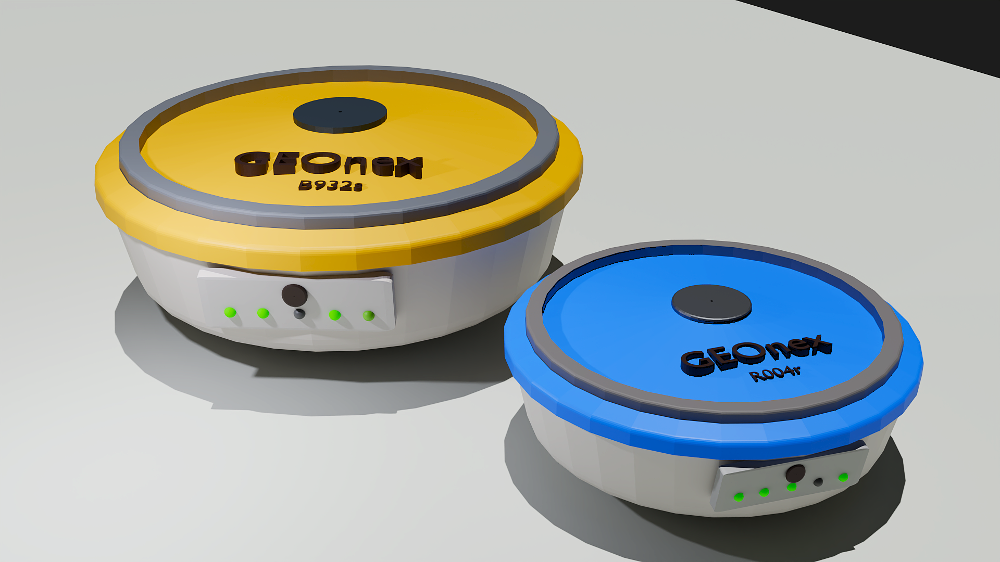

# Smart Surveying Device



The Smart Surveying Device is an innovative solution addressing the inefficiencies in land surveying, boundary marking, and construction layout tasks. It automates stake placement with high precision, reducing both manual labor and project costs.

### Enable GitHub Pages

You can put the things to be shown in GitHub pages into the _docs/_ folder. Both html and md file formats are supported. You need to go to settings and enable GitHub pages and select _main_ branch and _docs_ folder from the dropdowns, as shown in the below image.


### Special Configurations

These projects will be automatically added into [https://projects.ce.pdn.ac.lk](). If you like to show more details about your project on this site, you can fill the parameters in the file, _/docs/index.json_

```
{
  "title": "Smart Surveying Device",
  "team": [
    {
      "name": "Jayasingha B.V.R.R",
      "email": "e20168@eng.pdn.ac.lk",
      "eNumber": "E/20/168"
    },
    {
      "name": "Malinga G.A.I",
      "email": "e20242@eng.pdn.ac.lk",
      "eNumber": "E/20/242"
    },
    {
      "name": "Padeniya S.M.N.N",
      "email": "e20276@eng.pdn.ac.lk",
      "eNumber": "E/20/276"
    },
    {
      "name": "Seneviratne G.S",
      "email": "e20369@eng.pdn.ac.lk",
      "eNumber": "E/20/369"
     }
  ],
  "supervisors": [
    {
      "name": "Dr. Isuru Nawinne",
      "email": "isurunawinne@eng.pdn.ac.lk"
    }
  ],
  "tags": ["Web", "Embedded Systems"]
}
```

Once you filled this _index.json_ file, please verify the syntax is correct. (You can use [this](https://jsonlint.com/) tool).

### Page Theme

A custom theme integrated with this GitHub Page, which is based on [github.com/cepdnaclk/eYY-project-theme](https://github.com/cepdnaclk/eYY-project-theme). If you like to remove this default theme, you can remove the file, _docs/\_config.yml_ and use HTML based website.


## Database Structure - MongoDB ER Model

### Overview

This project utilizes a MongoDB-based NoSQL database optimized for a document-oriented approach. The system efficiently manages Users, Projects, Points, and Devices by leveraging references between collections and embedding where appropriate to ensure scalability and flexibility.
        Users and Projects → Referenced using User_Id
        Projects and Points → Referenced using Project_Id
        Projects and Devices → Devices are embedded inside Projects

### Database Schema Design
#### User Collection

Each User document contains essential details. Projects are stored separately and referenced using User_Id.

```
{
  "User_Id": 1,
  "Email": "user@example.com",
  "Password": "hashed_password",
  "Role": "admin",
  "Created_At": "2024-02-22",
  "Last_Login": "2024-02-23"
}

```
#### Project Collection (Referenced from User)
Each Project is stored separately and references a User_Id. The Devices used in a project are embedded inside the document
```
{
  "Project_Id": 101,
  "User_Id": 1,  // Reference to User collection
  "Name": "Project 1",
  "Created_On": "2024-02-20",
  "Last_Modified": "2024-02-22",
  "Status": "Completed",
  "Survey_Time": "12:00:00",
  "Description": "Road surver day-1",
  "Total_Points": 100,
  "Devices": [
    {
      "Name": "Device A",
      "Status": "Online",
      "Type": "Base",
      "Battery_Percentage": 90,
      "Signal_Strength": "Good",
      "Last_Update": "2024-02-22",
      "Hardware_Id": 301
    }
  ]  // Embedded devices
}
```

#### Point Collection (Referenced from Project)
Each Point represents a geographic location where survey data is collected. Instead of being embedded, each Point document references a Project_Id.
```
{
  "Point_Id": 5001,
  "Project_Id": 101,  // Reference to Project collection
  "Name": "Location 1",
  "Type": "Sensor Data",
  "Latitude": 45.1234,
  "Longitude": 93.1234,
  "Survey_Id": 25,
  "Accuracy": 1.5,
  "Timestamp": "12:05:00"
}

```

#### Device (Embedded in Project)
Devices are embedded inside Projects because they are tightly coupled with them, reducing unnecessary joins.
```
{
  "Name": "Device A",
  "Status": "Online",
  "Type": "Base",
  "Battery_Percentage": 90,
  "Signal_Strength": "Good",
  "Last_Update": "2024-02-22",
  "Hardware_Id": 301
}
```
### Entity-Relationship Diagram (ERD)

<svg xmlns="http://www.w3.org/2000/svg" style="cursor:pointer;max-width:100%;max-height:661px;" xmlns:xlink="http://www.w3.org/1999/xlink" version="1.1" width="651px" viewBox="-0.5 -0.5 651 661" content="&lt;mxfile host=&quot;app.diagrams.net&quot; agent=&quot;Mozilla/5.0 (Windows NT 10.0; Win64; x64) AppleWebKit/537.36 (KHTML, like Gecko) Chrome/133.0.0.0 Safari/537.36&quot; version=&quot;26.0.16&quot;&gt;&#10;  &lt;diagram id=&quot;R2lEEEUBdFMjLlhIrx00&quot; name=&quot;Page-1&quot;&gt;&#10;    &lt;mxGraphModel dx=&quot;1613&quot; dy=&quot;706&quot; grid=&quot;1&quot; gridSize=&quot;10&quot; guides=&quot;1&quot; tooltips=&quot;1&quot; connect=&quot;1&quot; arrows=&quot;1&quot; fold=&quot;1&quot; page=&quot;1&quot; pageScale=&quot;1&quot; pageWidth=&quot;850&quot; pageHeight=&quot;1100&quot; math=&quot;0&quot; shadow=&quot;0&quot; extFonts=&quot;Permanent Marker^https://fonts.googleapis.com/css?family=Permanent+Marker&quot;&gt;&#10;      &lt;root&gt;&#10;        &lt;mxCell id=&quot;0&quot; /&gt;&#10;        &lt;mxCell id=&quot;1&quot; parent=&quot;0&quot; /&gt;&#10;        &lt;mxCell id=&quot;C-vyLk0tnHw3VtMMgP7b-1&quot; value=&quot;&quot; style=&quot;edgeStyle=entityRelationEdgeStyle;endArrow=ERzeroToMany;startArrow=ERone;endFill=1;startFill=0;entryX=-0.013;entryY=0.053;entryDx=0;entryDy=0;entryPerimeter=0;&quot; parent=&quot;1&quot; source=&quot;C-vyLk0tnHw3VtMMgP7b-24&quot; target=&quot;u5_jgnClnFq-Hy03PWmp-6&quot; edge=&quot;1&quot;&gt;&#10;          &lt;mxGeometry width=&quot;100&quot; height=&quot;100&quot; relative=&quot;1&quot; as=&quot;geometry&quot;&gt;&#10;            &lt;mxPoint x=&quot;340&quot; y=&quot;720&quot; as=&quot;sourcePoint&quot; /&gt;&#10;            &lt;mxPoint x=&quot;450&quot; y=&quot;195&quot; as=&quot;targetPoint&quot; /&gt;&#10;          &lt;/mxGeometry&gt;&#10;        &lt;/mxCell&gt;&#10;        &lt;mxCell id=&quot;C-vyLk0tnHw3VtMMgP7b-23&quot; value=&quot;User&quot; style=&quot;shape=table;startSize=30;container=1;collapsible=1;childLayout=tableLayout;fixedRows=1;rowLines=0;fontStyle=1;align=center;resizeLast=1;&quot; parent=&quot;1&quot; vertex=&quot;1&quot;&gt;&#10;          &lt;mxGeometry x=&quot;90&quot; y=&quot;110&quot; width=&quot;260&quot; height=&quot;200&quot; as=&quot;geometry&quot; /&gt;&#10;        &lt;/mxCell&gt;&#10;        &lt;mxCell id=&quot;C-vyLk0tnHw3VtMMgP7b-24&quot; value=&quot;&quot; style=&quot;shape=partialRectangle;collapsible=0;dropTarget=0;pointerEvents=0;fillColor=none;points=[[0,0.5],[1,0.5]];portConstraint=eastwest;top=0;left=0;right=0;bottom=1;&quot; parent=&quot;C-vyLk0tnHw3VtMMgP7b-23&quot; vertex=&quot;1&quot;&gt;&#10;          &lt;mxGeometry y=&quot;30&quot; width=&quot;260&quot; height=&quot;30&quot; as=&quot;geometry&quot; /&gt;&#10;        &lt;/mxCell&gt;&#10;        &lt;mxCell id=&quot;C-vyLk0tnHw3VtMMgP7b-25&quot; value=&quot;PK&quot; style=&quot;shape=partialRectangle;overflow=hidden;connectable=0;fillColor=none;top=0;left=0;bottom=0;right=0;fontStyle=1;&quot; parent=&quot;C-vyLk0tnHw3VtMMgP7b-24&quot; vertex=&quot;1&quot;&gt;&#10;          &lt;mxGeometry width=&quot;30&quot; height=&quot;30&quot; as=&quot;geometry&quot;&gt;&#10;            &lt;mxRectangle width=&quot;30&quot; height=&quot;30&quot; as=&quot;alternateBounds&quot; /&gt;&#10;          &lt;/mxGeometry&gt;&#10;        &lt;/mxCell&gt;&#10;        &lt;mxCell id=&quot;C-vyLk0tnHw3VtMMgP7b-26&quot; value=&quot;User_Id               int             NOT NULL &quot; style=&quot;shape=partialRectangle;overflow=hidden;connectable=0;fillColor=none;top=0;left=0;bottom=0;right=0;align=left;spacingLeft=6;fontStyle=5;&quot; parent=&quot;C-vyLk0tnHw3VtMMgP7b-24&quot; vertex=&quot;1&quot;&gt;&#10;          &lt;mxGeometry x=&quot;30&quot; width=&quot;230&quot; height=&quot;30&quot; as=&quot;geometry&quot;&gt;&#10;            &lt;mxRectangle width=&quot;230&quot; height=&quot;30&quot; as=&quot;alternateBounds&quot; /&gt;&#10;          &lt;/mxGeometry&gt;&#10;        &lt;/mxCell&gt;&#10;        &lt;mxCell id=&quot;C-vyLk0tnHw3VtMMgP7b-27&quot; value=&quot;&quot; style=&quot;shape=partialRectangle;collapsible=0;dropTarget=0;pointerEvents=0;fillColor=none;points=[[0,0.5],[1,0.5]];portConstraint=eastwest;top=0;left=0;right=0;bottom=0;&quot; parent=&quot;C-vyLk0tnHw3VtMMgP7b-23&quot; vertex=&quot;1&quot;&gt;&#10;          &lt;mxGeometry y=&quot;60&quot; width=&quot;260&quot; height=&quot;140&quot; as=&quot;geometry&quot; /&gt;&#10;        &lt;/mxCell&gt;&#10;        &lt;mxCell id=&quot;C-vyLk0tnHw3VtMMgP7b-28&quot; value=&quot;&quot; style=&quot;shape=partialRectangle;overflow=hidden;connectable=0;fillColor=none;top=0;left=0;bottom=0;right=0;&quot; parent=&quot;C-vyLk0tnHw3VtMMgP7b-27&quot; vertex=&quot;1&quot;&gt;&#10;          &lt;mxGeometry width=&quot;30&quot; height=&quot;140&quot; as=&quot;geometry&quot;&gt;&#10;            &lt;mxRectangle width=&quot;30&quot; height=&quot;140&quot; as=&quot;alternateBounds&quot; /&gt;&#10;          &lt;/mxGeometry&gt;&#10;        &lt;/mxCell&gt;&#10;        &lt;mxCell id=&quot;C-vyLk0tnHw3VtMMgP7b-29&quot; value=&quot;Email Address     char(50)    NOT NULL&amp;#xa;&amp;#xa;Password(Hash)  char(50)    NOT NULL&amp;#xa;  &amp;#xa;Role                     char(50)    NOT NULL&amp;#xa;&amp;#xa;Created_At          date          NOT NULL&amp;#xa;&amp;#xa;Last_login            date          NOT NULL&quot; style=&quot;shape=partialRectangle;overflow=hidden;connectable=0;fillColor=none;top=0;left=0;bottom=0;right=0;align=left;spacingLeft=6;&quot; parent=&quot;C-vyLk0tnHw3VtMMgP7b-27&quot; vertex=&quot;1&quot;&gt;&#10;          &lt;mxGeometry x=&quot;30&quot; width=&quot;230&quot; height=&quot;140&quot; as=&quot;geometry&quot;&gt;&#10;            &lt;mxRectangle width=&quot;230&quot; height=&quot;140&quot; as=&quot;alternateBounds&quot; /&gt;&#10;          &lt;/mxGeometry&gt;&#10;        &lt;/mxCell&gt;&#10;        &lt;mxCell id=&quot;u5_jgnClnFq-Hy03PWmp-1&quot; value=&quot;FK&quot; style=&quot;text;html=1;align=center;verticalAlign=middle;whiteSpace=wrap;rounded=0;&quot; parent=&quot;1&quot; vertex=&quot;1&quot;&gt;&#10;          &lt;mxGeometry x=&quot;450&quot; y=&quot;175&quot; width=&quot;40&quot; height=&quot;20&quot; as=&quot;geometry&quot; /&gt;&#10;        &lt;/mxCell&gt;&#10;        &lt;mxCell id=&quot;u5_jgnClnFq-Hy03PWmp-2&quot; value=&quot;Project&quot; style=&quot;shape=table;startSize=30;container=1;collapsible=1;childLayout=tableLayout;fixedRows=1;rowLines=0;fontStyle=1;align=center;resizeLast=1;&quot; parent=&quot;1&quot; vertex=&quot;1&quot;&gt;&#10;          &lt;mxGeometry x=&quot;450&quot; y=&quot;110&quot; width=&quot;280&quot; height=&quot;310&quot; as=&quot;geometry&quot; /&gt;&#10;        &lt;/mxCell&gt;&#10;        &lt;mxCell id=&quot;u5_jgnClnFq-Hy03PWmp-3&quot; value=&quot;&quot; style=&quot;shape=partialRectangle;collapsible=0;dropTarget=0;pointerEvents=0;fillColor=none;points=[[0,0.5],[1,0.5]];portConstraint=eastwest;top=0;left=0;right=0;bottom=1;&quot; parent=&quot;u5_jgnClnFq-Hy03PWmp-2&quot; vertex=&quot;1&quot;&gt;&#10;          &lt;mxGeometry y=&quot;30&quot; width=&quot;280&quot; height=&quot;30&quot; as=&quot;geometry&quot; /&gt;&#10;        &lt;/mxCell&gt;&#10;        &lt;mxCell id=&quot;u5_jgnClnFq-Hy03PWmp-4&quot; value=&quot;PK&quot; style=&quot;shape=partialRectangle;overflow=hidden;connectable=0;fillColor=none;top=0;left=0;bottom=0;right=0;fontStyle=1;&quot; parent=&quot;u5_jgnClnFq-Hy03PWmp-3&quot; vertex=&quot;1&quot;&gt;&#10;          &lt;mxGeometry width=&quot;30&quot; height=&quot;30&quot; as=&quot;geometry&quot;&gt;&#10;            &lt;mxRectangle width=&quot;30&quot; height=&quot;30&quot; as=&quot;alternateBounds&quot; /&gt;&#10;          &lt;/mxGeometry&gt;&#10;        &lt;/mxCell&gt;&#10;        &lt;mxCell id=&quot;u5_jgnClnFq-Hy03PWmp-5&quot; value=&quot;Project_Id          int                 NOT NULL &quot; style=&quot;shape=partialRectangle;overflow=hidden;connectable=0;fillColor=none;top=0;left=0;bottom=0;right=0;align=left;spacingLeft=6;fontStyle=5;&quot; parent=&quot;u5_jgnClnFq-Hy03PWmp-3&quot; vertex=&quot;1&quot;&gt;&#10;          &lt;mxGeometry x=&quot;30&quot; width=&quot;250&quot; height=&quot;30&quot; as=&quot;geometry&quot;&gt;&#10;            &lt;mxRectangle width=&quot;250&quot; height=&quot;30&quot; as=&quot;alternateBounds&quot; /&gt;&#10;          &lt;/mxGeometry&gt;&#10;        &lt;/mxCell&gt;&#10;        &lt;mxCell id=&quot;u5_jgnClnFq-Hy03PWmp-6&quot; value=&quot;&quot; style=&quot;shape=partialRectangle;collapsible=0;dropTarget=0;pointerEvents=0;fillColor=none;points=[[0,0.5],[1,0.5]];portConstraint=eastwest;top=0;left=0;right=0;bottom=0;&quot; parent=&quot;u5_jgnClnFq-Hy03PWmp-2&quot; vertex=&quot;1&quot;&gt;&#10;          &lt;mxGeometry y=&quot;60&quot; width=&quot;280&quot; height=&quot;250&quot; as=&quot;geometry&quot; /&gt;&#10;        &lt;/mxCell&gt;&#10;        &lt;mxCell id=&quot;u5_jgnClnFq-Hy03PWmp-7&quot; value=&quot;&quot; style=&quot;shape=partialRectangle;overflow=hidden;connectable=0;fillColor=none;top=0;left=0;bottom=0;right=0;&quot; parent=&quot;u5_jgnClnFq-Hy03PWmp-6&quot; vertex=&quot;1&quot;&gt;&#10;          &lt;mxGeometry width=&quot;30&quot; height=&quot;250&quot; as=&quot;geometry&quot;&gt;&#10;            &lt;mxRectangle width=&quot;30&quot; height=&quot;250&quot; as=&quot;alternateBounds&quot; /&gt;&#10;          &lt;/mxGeometry&gt;&#10;        &lt;/mxCell&gt;&#10;        &lt;mxCell id=&quot;u5_jgnClnFq-Hy03PWmp-8&quot; value=&quot;User_Id               int                  NOT NULL&amp;#xa;&amp;#xa;Name                 Char(30)         NOT NULL&amp;#xa; &amp;#xa;Created_On       date                NOT NULL&amp;#xa;&amp;#xa;Last_Modified     date               NOT NULL&amp;#xa;&amp;#xa;Status                 Char(30)        NOT NULL&amp;#xa;&amp;#xa;Survey Time       time&amp;#xa;&amp;#xa;Description         Char(200) &amp;#xa;&amp;#xa;Total points         int&amp;#xa;&amp;#xa;Devices              Device Type  &quot; style=&quot;shape=partialRectangle;overflow=hidden;connectable=0;fillColor=none;top=0;left=0;bottom=0;right=0;align=left;spacingLeft=6;&quot; parent=&quot;u5_jgnClnFq-Hy03PWmp-6&quot; vertex=&quot;1&quot;&gt;&#10;          &lt;mxGeometry x=&quot;30&quot; width=&quot;250&quot; height=&quot;250&quot; as=&quot;geometry&quot;&gt;&#10;            &lt;mxRectangle width=&quot;250&quot; height=&quot;250&quot; as=&quot;alternateBounds&quot; /&gt;&#10;          &lt;/mxGeometry&gt;&#10;        &lt;/mxCell&gt;&#10;        &lt;mxCell id=&quot;u5_jgnClnFq-Hy03PWmp-20&quot; value=&quot;Point&quot; style=&quot;shape=table;startSize=30;container=1;collapsible=1;childLayout=tableLayout;fixedRows=1;rowLines=0;fontStyle=1;align=center;resizeLast=1;&quot; parent=&quot;1&quot; vertex=&quot;1&quot;&gt;&#10;          &lt;mxGeometry x=&quot;80&quot; y=&quot;450&quot; width=&quot;280&quot; height=&quot;300&quot; as=&quot;geometry&quot; /&gt;&#10;        &lt;/mxCell&gt;&#10;        &lt;mxCell id=&quot;u5_jgnClnFq-Hy03PWmp-21&quot; value=&quot;&quot; style=&quot;shape=partialRectangle;collapsible=0;dropTarget=0;pointerEvents=0;fillColor=none;points=[[0,0.5],[1,0.5]];portConstraint=eastwest;top=0;left=0;right=0;bottom=1;&quot; parent=&quot;u5_jgnClnFq-Hy03PWmp-20&quot; vertex=&quot;1&quot;&gt;&#10;          &lt;mxGeometry y=&quot;30&quot; width=&quot;280&quot; height=&quot;30&quot; as=&quot;geometry&quot; /&gt;&#10;        &lt;/mxCell&gt;&#10;        &lt;mxCell id=&quot;u5_jgnClnFq-Hy03PWmp-22&quot; value=&quot;PK&quot; style=&quot;shape=partialRectangle;overflow=hidden;connectable=0;fillColor=none;top=0;left=0;bottom=0;right=0;fontStyle=1;&quot; parent=&quot;u5_jgnClnFq-Hy03PWmp-21&quot; vertex=&quot;1&quot;&gt;&#10;          &lt;mxGeometry width=&quot;30&quot; height=&quot;30&quot; as=&quot;geometry&quot;&gt;&#10;            &lt;mxRectangle width=&quot;30&quot; height=&quot;30&quot; as=&quot;alternateBounds&quot; /&gt;&#10;          &lt;/mxGeometry&gt;&#10;        &lt;/mxCell&gt;&#10;        &lt;mxCell id=&quot;u5_jgnClnFq-Hy03PWmp-23&quot; value=&quot;Point_Id            int               NOT NULL &quot; style=&quot;shape=partialRectangle;overflow=hidden;connectable=0;fillColor=none;top=0;left=0;bottom=0;right=0;align=left;spacingLeft=6;fontStyle=5;&quot; parent=&quot;u5_jgnClnFq-Hy03PWmp-21&quot; vertex=&quot;1&quot;&gt;&#10;          &lt;mxGeometry x=&quot;30&quot; width=&quot;250&quot; height=&quot;30&quot; as=&quot;geometry&quot;&gt;&#10;            &lt;mxRectangle width=&quot;250&quot; height=&quot;30&quot; as=&quot;alternateBounds&quot; /&gt;&#10;          &lt;/mxGeometry&gt;&#10;        &lt;/mxCell&gt;&#10;        &lt;mxCell id=&quot;u5_jgnClnFq-Hy03PWmp-24&quot; value=&quot;&quot; style=&quot;shape=partialRectangle;collapsible=0;dropTarget=0;pointerEvents=0;fillColor=none;points=[[0,0.5],[1,0.5]];portConstraint=eastwest;top=0;left=0;right=0;bottom=0;&quot; parent=&quot;u5_jgnClnFq-Hy03PWmp-20&quot; vertex=&quot;1&quot;&gt;&#10;          &lt;mxGeometry y=&quot;60&quot; width=&quot;280&quot; height=&quot;240&quot; as=&quot;geometry&quot; /&gt;&#10;        &lt;/mxCell&gt;&#10;        &lt;mxCell id=&quot;u5_jgnClnFq-Hy03PWmp-25&quot; value=&quot;&quot; style=&quot;shape=partialRectangle;overflow=hidden;connectable=0;fillColor=none;top=0;left=0;bottom=0;right=0;&quot; parent=&quot;u5_jgnClnFq-Hy03PWmp-24&quot; vertex=&quot;1&quot;&gt;&#10;          &lt;mxGeometry width=&quot;30&quot; height=&quot;240&quot; as=&quot;geometry&quot;&gt;&#10;            &lt;mxRectangle width=&quot;30&quot; height=&quot;240&quot; as=&quot;alternateBounds&quot; /&gt;&#10;          &lt;/mxGeometry&gt;&#10;        &lt;/mxCell&gt;&#10;        &lt;mxCell id=&quot;u5_jgnClnFq-Hy03PWmp-26&quot; value=&quot;Project_Id         int                 NOT NULL&amp;#xa;&amp;#xa;Name               Char(30)       NOT NULL&amp;#xa;&amp;#xa;Type                 Char(30)      NOT NULL&amp;#xa;&amp;#xa;Latitude            Float            NOT NULL&amp;#xa;&amp;#xa;Longitude         Float            NOT NULL&amp;#xa;&amp;#xa;Survey_Id        int                 NOT NULL&amp;#xa;&amp;#xa;Accuracy          Float            NOT NULL &amp;#xa;&amp;#xa;Timestamp       time &quot; style=&quot;shape=partialRectangle;overflow=hidden;connectable=0;fillColor=none;top=0;left=0;bottom=0;right=0;align=left;spacingLeft=6;&quot; parent=&quot;u5_jgnClnFq-Hy03PWmp-24&quot; vertex=&quot;1&quot;&gt;&#10;          &lt;mxGeometry x=&quot;30&quot; width=&quot;250&quot; height=&quot;240&quot; as=&quot;geometry&quot;&gt;&#10;            &lt;mxRectangle width=&quot;250&quot; height=&quot;240&quot; as=&quot;alternateBounds&quot; /&gt;&#10;          &lt;/mxGeometry&gt;&#10;        &lt;/mxCell&gt;&#10;        &lt;mxCell id=&quot;u5_jgnClnFq-Hy03PWmp-27&quot; value=&quot;&quot; style=&quot;endArrow=none;dashed=1;html=1;dashPattern=1 3;strokeWidth=2;rounded=0;entryX=0;entryY=0.96;entryDx=0;entryDy=0;entryPerimeter=0;&quot; parent=&quot;1&quot; target=&quot;u5_jgnClnFq-Hy03PWmp-6&quot; edge=&quot;1&quot;&gt;&#10;          &lt;mxGeometry width=&quot;50&quot; height=&quot;50&quot; relative=&quot;1&quot; as=&quot;geometry&quot;&gt;&#10;            &lt;mxPoint x=&quot;420&quot; y=&quot;410&quot; as=&quot;sourcePoint&quot; /&gt;&#10;            &lt;mxPoint x=&quot;430&quot; y=&quot;410&quot; as=&quot;targetPoint&quot; /&gt;&#10;          &lt;/mxGeometry&gt;&#10;        &lt;/mxCell&gt;&#10;        &lt;mxCell id=&quot;u5_jgnClnFq-Hy03PWmp-28&quot; value=&quot;&quot; style=&quot;endArrow=none;dashed=1;html=1;dashPattern=1 3;strokeWidth=2;rounded=0;&quot; parent=&quot;1&quot; edge=&quot;1&quot;&gt;&#10;          &lt;mxGeometry width=&quot;50&quot; height=&quot;50&quot; relative=&quot;1&quot; as=&quot;geometry&quot;&gt;&#10;            &lt;mxPoint x=&quot;420&quot; y=&quot;500&quot; as=&quot;sourcePoint&quot; /&gt;&#10;            &lt;mxPoint x=&quot;420&quot; y=&quot;410&quot; as=&quot;targetPoint&quot; /&gt;&#10;          &lt;/mxGeometry&gt;&#10;        &lt;/mxCell&gt;&#10;        &lt;mxCell id=&quot;u5_jgnClnFq-Hy03PWmp-32&quot; value=&quot;&quot; style=&quot;endArrow=none;dashed=1;html=1;dashPattern=1 3;strokeWidth=2;rounded=0;exitX=-0.008;exitY=0.037;exitDx=0;exitDy=0;exitPerimeter=0;&quot; parent=&quot;1&quot; edge=&quot;1&quot;&gt;&#10;          &lt;mxGeometry width=&quot;50&quot; height=&quot;50&quot; relative=&quot;1&quot; as=&quot;geometry&quot;&gt;&#10;            &lt;mxPoint x=&quot;447.9200000000001&quot; y=&quot;500.73&quot; as=&quot;sourcePoint&quot; /&gt;&#10;            &lt;mxPoint x=&quot;420&quot; y=&quot;500&quot; as=&quot;targetPoint&quot; /&gt;&#10;          &lt;/mxGeometry&gt;&#10;        &lt;/mxCell&gt;&#10;        &lt;mxCell id=&quot;dpoCyt-iHPjLtTPDpgOf-1&quot; value=&quot;FK&quot; style=&quot;text;html=1;align=center;verticalAlign=middle;whiteSpace=wrap;rounded=0;&quot; parent=&quot;1&quot; vertex=&quot;1&quot;&gt;&#10;          &lt;mxGeometry x=&quot;80&quot; y=&quot;520&quot; width=&quot;30&quot; height=&quot;20&quot; as=&quot;geometry&quot; /&gt;&#10;        &lt;/mxCell&gt;&#10;        &lt;mxCell id=&quot;dpoCyt-iHPjLtTPDpgOf-8&quot; value=&quot;&quot; style=&quot;group&quot; parent=&quot;1&quot; connectable=&quot;0&quot; vertex=&quot;1&quot;&gt;&#10;          &lt;mxGeometry x=&quot;450&quot; y=&quot;490&quot; width=&quot;260&quot; height=&quot;280&quot; as=&quot;geometry&quot; /&gt;&#10;        &lt;/mxCell&gt;&#10;        &lt;mxCell id=&quot;dpoCyt-iHPjLtTPDpgOf-3&quot; value=&quot;Device&quot; style=&quot;swimlane;whiteSpace=wrap;html=1;&quot; parent=&quot;dpoCyt-iHPjLtTPDpgOf-8&quot; vertex=&quot;1&quot;&gt;&#10;          &lt;mxGeometry width=&quot;240&quot; height=&quot;280&quot; as=&quot;geometry&quot; /&gt;&#10;        &lt;/mxCell&gt;&#10;        &lt;mxCell id=&quot;dpoCyt-iHPjLtTPDpgOf-7&quot; value=&quot;&amp;lt;span style=&amp;quot;color: rgb(0, 0, 0); font-family: Helvetica; font-size: 12px; font-style: normal; font-variant-ligatures: normal; font-variant-caps: normal; font-weight: 400; letter-spacing: normal; orphans: 2; text-align: left; text-indent: 0px; text-transform: none; widows: 2; word-spacing: 0px; -webkit-text-stroke-width: 0px; white-space: nowrap; background-color: rgb(251, 251, 251); text-decoration-thickness: initial; text-decoration-style: initial; text-decoration-color: initial; display: inline !important; float: none;&amp;quot;&amp;gt;Name&amp;amp;nbsp; &amp;amp;nbsp; &amp;amp;nbsp; &amp;amp;nbsp; &amp;amp;nbsp; &amp;amp;nbsp; &amp;amp;nbsp; &amp;amp;nbsp; Char(30)&amp;amp;nbsp; &amp;amp;nbsp; &amp;amp;nbsp; NOT NULL&amp;lt;/span&amp;gt;&amp;lt;br style=&amp;quot;forced-color-adjust: none; padding: 0px; margin: 0px; color: rgb(0, 0, 0); font-family: Helvetica; font-size: 12px; font-style: normal; font-variant-ligatures: normal; font-variant-caps: normal; font-weight: 400; letter-spacing: normal; orphans: 2; text-align: left; text-indent: 0px; text-transform: none; widows: 2; word-spacing: 0px; -webkit-text-stroke-width: 0px; white-space: nowrap; background-color: rgb(251, 251, 251); text-decoration-thickness: initial; text-decoration-style: initial; text-decoration-color: initial;&amp;quot;&amp;gt;&amp;lt;br style=&amp;quot;forced-color-adjust: none; padding: 0px; margin: 0px; color: rgb(0, 0, 0); font-family: Helvetica; font-size: 12px; font-style: normal; font-variant-ligatures: normal; font-variant-caps: normal; font-weight: 400; letter-spacing: normal; orphans: 2; text-align: left; text-indent: 0px; text-transform: none; widows: 2; word-spacing: 0px; -webkit-text-stroke-width: 0px; white-space: nowrap; background-color: rgb(251, 251, 251); text-decoration-thickness: initial; text-decoration-style: initial; text-decoration-color: initial;&amp;quot;&amp;gt;&amp;lt;span style=&amp;quot;color: rgb(0, 0, 0); font-family: Helvetica; font-size: 12px; font-style: normal; font-variant-ligatures: normal; font-variant-caps: normal; font-weight: 400; letter-spacing: normal; orphans: 2; text-align: left; text-indent: 0px; text-transform: none; widows: 2; word-spacing: 0px; -webkit-text-stroke-width: 0px; white-space: nowrap; background-color: rgb(251, 251, 251); text-decoration-thickness: initial; text-decoration-style: initial; text-decoration-color: initial; display: inline !important; float: none;&amp;quot;&amp;gt;Status&amp;amp;nbsp; &amp;amp;nbsp; &amp;amp;nbsp; &amp;amp;nbsp; &amp;amp;nbsp; &amp;amp;nbsp; &amp;amp;nbsp; &amp;amp;nbsp;Char(30)&amp;amp;nbsp; &amp;amp;nbsp; &amp;amp;nbsp; NOT NULL&amp;lt;/span&amp;gt;&amp;lt;br style=&amp;quot;forced-color-adjust: none; padding: 0px; margin: 0px; color: rgb(0, 0, 0); font-family: Helvetica; font-size: 12px; font-style: normal; font-variant-ligatures: normal; font-variant-caps: normal; font-weight: 400; letter-spacing: normal; orphans: 2; text-align: left; text-indent: 0px; text-transform: none; widows: 2; word-spacing: 0px; -webkit-text-stroke-width: 0px; white-space: nowrap; background-color: rgb(251, 251, 251); text-decoration-thickness: initial; text-decoration-style: initial; text-decoration-color: initial;&amp;quot;&amp;gt;&amp;lt;br style=&amp;quot;forced-color-adjust: none; padding: 0px; margin: 0px; color: rgb(0, 0, 0); font-family: Helvetica; font-size: 12px; font-style: normal; font-variant-ligatures: normal; font-variant-caps: normal; font-weight: 400; letter-spacing: normal; orphans: 2; text-align: left; text-indent: 0px; text-transform: none; widows: 2; word-spacing: 0px; -webkit-text-stroke-width: 0px; white-space: nowrap; background-color: rgb(251, 251, 251); text-decoration-thickness: initial; text-decoration-style: initial; text-decoration-color: initial;&amp;quot;&amp;gt;&amp;lt;span style=&amp;quot;color: rgb(0, 0, 0); font-family: Helvetica; font-size: 12px; font-style: normal; font-variant-ligatures: normal; font-variant-caps: normal; font-weight: 400; letter-spacing: normal; orphans: 2; text-align: left; text-indent: 0px; text-transform: none; widows: 2; word-spacing: 0px; -webkit-text-stroke-width: 0px; white-space: nowrap; background-color: rgb(251, 251, 251); text-decoration-thickness: initial; text-decoration-style: initial; text-decoration-color: initial; display: inline !important; float: none;&amp;quot;&amp;gt;Type&amp;amp;nbsp; &amp;amp;nbsp; &amp;amp;nbsp; &amp;amp;nbsp; &amp;amp;nbsp; &amp;amp;nbsp; &amp;amp;nbsp; &amp;amp;nbsp; &amp;amp;nbsp; Char(30)&amp;amp;nbsp; &amp;amp;nbsp; &amp;amp;nbsp; NOT NULL&amp;lt;/span&amp;gt;&amp;lt;br style=&amp;quot;forced-color-adjust: none; padding: 0px; margin: 0px; color: rgb(0, 0, 0); font-family: Helvetica; font-size: 12px; font-style: normal; font-variant-ligatures: normal; font-variant-caps: normal; font-weight: 400; letter-spacing: normal; orphans: 2; text-align: left; text-indent: 0px; text-transform: none; widows: 2; word-spacing: 0px; -webkit-text-stroke-width: 0px; white-space: nowrap; background-color: rgb(251, 251, 251); text-decoration-thickness: initial; text-decoration-style: initial; text-decoration-color: initial;&amp;quot;&amp;gt;&amp;lt;span style=&amp;quot;color: rgb(0, 0, 0); font-family: Helvetica; font-size: 12px; font-style: normal; font-variant-ligatures: normal; font-variant-caps: normal; font-weight: 400; letter-spacing: normal; orphans: 2; text-align: left; text-indent: 0px; text-transform: none; widows: 2; word-spacing: 0px; -webkit-text-stroke-width: 0px; white-space: nowrap; background-color: rgb(251, 251, 251); text-decoration-thickness: initial; text-decoration-style: initial; text-decoration-color: initial; display: inline !important; float: none;&amp;quot;&amp;gt;&amp;amp;nbsp; &amp;amp;nbsp;&amp;lt;/span&amp;gt;&amp;lt;br style=&amp;quot;forced-color-adjust: none; padding: 0px; margin: 0px; color: rgb(0, 0, 0); font-family: Helvetica; font-size: 12px; font-style: normal; font-variant-ligatures: normal; font-variant-caps: normal; font-weight: 400; letter-spacing: normal; orphans: 2; text-align: left; text-indent: 0px; text-transform: none; widows: 2; word-spacing: 0px; -webkit-text-stroke-width: 0px; white-space: nowrap; background-color: rgb(251, 251, 251); text-decoration-thickness: initial; text-decoration-style: initial; text-decoration-color: initial;&amp;quot;&amp;gt;&amp;lt;span style=&amp;quot;color: rgb(0, 0, 0); font-family: Helvetica; font-size: 12px; font-style: normal; font-variant-ligatures: normal; font-variant-caps: normal; font-weight: 400; letter-spacing: normal; orphans: 2; text-align: left; text-indent: 0px; text-transform: none; widows: 2; word-spacing: 0px; -webkit-text-stroke-width: 0px; white-space: nowrap; background-color: rgb(251, 251, 251); text-decoration-thickness: initial; text-decoration-style: initial; text-decoration-color: initial; display: inline !important; float: none;&amp;quot;&amp;gt;Batttery&amp;amp;nbsp;&amp;lt;/span&amp;gt;&amp;lt;br style=&amp;quot;forced-color-adjust: none; padding: 0px; margin: 0px; color: rgb(0, 0, 0); font-family: Helvetica; font-size: 12px; font-style: normal; font-variant-ligatures: normal; font-variant-caps: normal; font-weight: 400; letter-spacing: normal; orphans: 2; text-align: left; text-indent: 0px; text-transform: none; widows: 2; word-spacing: 0px; -webkit-text-stroke-width: 0px; white-space: nowrap; background-color: rgb(251, 251, 251); text-decoration-thickness: initial; text-decoration-style: initial; text-decoration-color: initial;&amp;quot;&amp;gt;&amp;lt;span style=&amp;quot;color: rgb(0, 0, 0); font-family: Helvetica; font-size: 12px; font-style: normal; font-variant-ligatures: normal; font-variant-caps: normal; font-weight: 400; letter-spacing: normal; orphans: 2; text-align: left; text-indent: 0px; text-transform: none; widows: 2; word-spacing: 0px; -webkit-text-stroke-width: 0px; white-space: nowrap; background-color: rgb(251, 251, 251); text-decoration-thickness: initial; text-decoration-style: initial; text-decoration-color: initial; display: inline !important; float: none;&amp;quot;&amp;gt;Percentage&amp;amp;nbsp; &amp;amp;nbsp; &amp;amp;nbsp; &amp;amp;nbsp; int&amp;amp;nbsp; &amp;amp;nbsp; &amp;amp;nbsp; &amp;amp;nbsp; &amp;amp;nbsp; &amp;amp;nbsp; &amp;amp;nbsp; &amp;amp;nbsp;NOT NULL&amp;lt;/span&amp;gt;&amp;lt;br style=&amp;quot;forced-color-adjust: none; padding: 0px; margin: 0px; color: rgb(0, 0, 0); font-family: Helvetica; font-size: 12px; font-style: normal; font-variant-ligatures: normal; font-variant-caps: normal; font-weight: 400; letter-spacing: normal; orphans: 2; text-align: left; text-indent: 0px; text-transform: none; widows: 2; word-spacing: 0px; -webkit-text-stroke-width: 0px; white-space: nowrap; background-color: rgb(251, 251, 251); text-decoration-thickness: initial; text-decoration-style: initial; text-decoration-color: initial;&amp;quot;&amp;gt;&amp;lt;br style=&amp;quot;forced-color-adjust: none; padding: 0px; margin: 0px; color: rgb(0, 0, 0); font-family: Helvetica; font-size: 12px; font-style: normal; font-variant-ligatures: normal; font-variant-caps: normal; font-weight: 400; letter-spacing: normal; orphans: 2; text-align: left; text-indent: 0px; text-transform: none; widows: 2; word-spacing: 0px; -webkit-text-stroke-width: 0px; white-space: nowrap; background-color: rgb(251, 251, 251); text-decoration-thickness: initial; text-decoration-style: initial; text-decoration-color: initial;&amp;quot;&amp;gt;&amp;lt;span style=&amp;quot;color: rgb(0, 0, 0); font-family: Helvetica; font-size: 12px; font-style: normal; font-variant-ligatures: normal; font-variant-caps: normal; font-weight: 400; letter-spacing: normal; orphans: 2; text-align: left; text-indent: 0px; text-transform: none; widows: 2; word-spacing: 0px; -webkit-text-stroke-width: 0px; white-space: nowrap; background-color: rgb(251, 251, 251); text-decoration-thickness: initial; text-decoration-style: initial; text-decoration-color: initial; display: inline !important; float: none;&amp;quot;&amp;gt;Signal&amp;lt;/span&amp;gt;&amp;lt;br style=&amp;quot;forced-color-adjust: none; padding: 0px; margin: 0px; color: rgb(0, 0, 0); font-family: Helvetica; font-size: 12px; font-style: normal; font-variant-ligatures: normal; font-variant-caps: normal; font-weight: 400; letter-spacing: normal; orphans: 2; text-align: left; text-indent: 0px; text-transform: none; widows: 2; word-spacing: 0px; -webkit-text-stroke-width: 0px; white-space: nowrap; background-color: rgb(251, 251, 251); text-decoration-thickness: initial; text-decoration-style: initial; text-decoration-color: initial;&amp;quot;&amp;gt;&amp;lt;span style=&amp;quot;color: rgb(0, 0, 0); font-family: Helvetica; font-size: 12px; font-style: normal; font-variant-ligatures: normal; font-variant-caps: normal; font-weight: 400; letter-spacing: normal; orphans: 2; text-align: left; text-indent: 0px; text-transform: none; widows: 2; word-spacing: 0px; -webkit-text-stroke-width: 0px; white-space: nowrap; background-color: rgb(251, 251, 251); text-decoration-thickness: initial; text-decoration-style: initial; text-decoration-color: initial; display: inline !important; float: none;&amp;quot;&amp;gt;Strength&amp;amp;nbsp; &amp;amp;nbsp; &amp;amp;nbsp; &amp;amp;nbsp; &amp;amp;nbsp; &amp;amp;nbsp; Char(30)&amp;amp;nbsp; &amp;amp;nbsp;&amp;amp;nbsp;&amp;lt;/span&amp;gt;&amp;lt;br style=&amp;quot;forced-color-adjust: none; padding: 0px; margin: 0px; color: rgb(0, 0, 0); font-family: Helvetica; font-size: 12px; font-style: normal; font-variant-ligatures: normal; font-variant-caps: normal; font-weight: 400; letter-spacing: normal; orphans: 2; text-align: left; text-indent: 0px; text-transform: none; widows: 2; word-spacing: 0px; -webkit-text-stroke-width: 0px; white-space: nowrap; background-color: rgb(251, 251, 251); text-decoration-thickness: initial; text-decoration-style: initial; text-decoration-color: initial;&amp;quot;&amp;gt;&amp;lt;br style=&amp;quot;forced-color-adjust: none; padding: 0px; margin: 0px; color: rgb(0, 0, 0); font-family: Helvetica; font-size: 12px; font-style: normal; font-variant-ligatures: normal; font-variant-caps: normal; font-weight: 400; letter-spacing: normal; orphans: 2; text-align: left; text-indent: 0px; text-transform: none; widows: 2; word-spacing: 0px; -webkit-text-stroke-width: 0px; white-space: nowrap; background-color: rgb(251, 251, 251); text-decoration-thickness: initial; text-decoration-style: initial; text-decoration-color: initial;&amp;quot;&amp;gt;&amp;lt;span style=&amp;quot;color: rgb(0, 0, 0); font-family: Helvetica; font-size: 12px; font-style: normal; font-variant-ligatures: normal; font-variant-caps: normal; font-weight: 400; letter-spacing: normal; orphans: 2; text-align: left; text-indent: 0px; text-transform: none; widows: 2; word-spacing: 0px; -webkit-text-stroke-width: 0px; white-space: nowrap; background-color: rgb(251, 251, 251); text-decoration-thickness: initial; text-decoration-style: initial; text-decoration-color: initial; display: inline !important; float: none;&amp;quot;&amp;gt;Last_Update&amp;amp;nbsp; &amp;amp;nbsp; &amp;amp;nbsp; date&amp;lt;/span&amp;gt;&amp;lt;br style=&amp;quot;forced-color-adjust: none; padding: 0px; margin: 0px; color: rgb(0, 0, 0); font-family: Helvetica; font-size: 12px; font-style: normal; font-variant-ligatures: normal; font-variant-caps: normal; font-weight: 400; letter-spacing: normal; orphans: 2; text-align: left; text-indent: 0px; text-transform: none; widows: 2; word-spacing: 0px; -webkit-text-stroke-width: 0px; white-space: nowrap; background-color: rgb(251, 251, 251); text-decoration-thickness: initial; text-decoration-style: initial; text-decoration-color: initial;&amp;quot;&amp;gt;&amp;lt;br style=&amp;quot;forced-color-adjust: none; padding: 0px; margin: 0px; color: rgb(0, 0, 0); font-family: Helvetica; font-size: 12px; font-style: normal; font-variant-ligatures: normal; font-variant-caps: normal; font-weight: 400; letter-spacing: normal; orphans: 2; text-align: left; text-indent: 0px; text-transform: none; widows: 2; word-spacing: 0px; -webkit-text-stroke-width: 0px; white-space: nowrap; background-color: rgb(251, 251, 251); text-decoration-thickness: initial; text-decoration-style: initial; text-decoration-color: initial;&amp;quot;&amp;gt;&amp;lt;span style=&amp;quot;color: rgb(0, 0, 0); font-family: Helvetica; font-size: 12px; font-style: normal; font-variant-ligatures: normal; font-variant-caps: normal; font-weight: 400; letter-spacing: normal; orphans: 2; text-align: left; text-indent: 0px; text-transform: none; widows: 2; word-spacing: 0px; -webkit-text-stroke-width: 0px; white-space: nowrap; background-color: rgb(251, 251, 251); text-decoration-thickness: initial; text-decoration-style: initial; text-decoration-color: initial; display: inline !important; float: none;&amp;quot;&amp;gt;Hardware_Id&amp;amp;nbsp; &amp;amp;nbsp; &amp;amp;nbsp; int&amp;amp;nbsp; &amp;amp;nbsp; &amp;amp;nbsp; &amp;amp;nbsp; &amp;amp;nbsp; &amp;amp;nbsp; &amp;amp;nbsp; &amp;amp;nbsp;NOT NULL&amp;lt;/span&amp;gt;&amp;lt;br style=&amp;quot;forced-color-adjust: none; padding: 0px; margin: 0px; color: rgb(0, 0, 0); font-family: Helvetica; font-size: 12px; font-style: normal; font-variant-ligatures: normal; font-variant-caps: normal; font-weight: 400; letter-spacing: normal; orphans: 2; text-align: left; text-indent: 0px; text-transform: none; widows: 2; word-spacing: 0px; -webkit-text-stroke-width: 0px; white-space: nowrap; background-color: rgb(251, 251, 251); text-decoration-thickness: initial; text-decoration-style: initial; text-decoration-color: initial;&amp;quot;&amp;gt;&amp;lt;span style=&amp;quot;color: rgb(0, 0, 0); font-family: Helvetica; font-size: 12px; font-style: normal; font-variant-ligatures: normal; font-variant-caps: normal; font-weight: 400; letter-spacing: normal; orphans: 2; text-align: left; text-indent: 0px; text-transform: none; widows: 2; word-spacing: 0px; -webkit-text-stroke-width: 0px; white-space: nowrap; background-color: rgb(251, 251, 251); text-decoration-thickness: initial; text-decoration-style: initial; text-decoration-color: initial; display: inline !important; float: none;&amp;quot;&amp;gt;&amp;amp;nbsp;&amp;amp;nbsp;&amp;lt;/span&amp;gt;&quot; style=&quot;text;whiteSpace=wrap;html=1;&quot; parent=&quot;dpoCyt-iHPjLtTPDpgOf-8&quot; vertex=&quot;1&quot;&gt;&#10;          &lt;mxGeometry x=&quot;10&quot; y=&quot;30&quot; width=&quot;250&quot; height=&quot;250&quot; as=&quot;geometry&quot; /&gt;&#10;        &lt;/mxCell&gt;&#10;        &lt;mxCell id=&quot;C-vyLk0tnHw3VtMMgP7b-12&quot; value=&quot;&quot; style=&quot;edgeStyle=entityRelationEdgeStyle;endArrow=ERzeroToMany;startArrow=ERone;endFill=1;startFill=0;exitX=0;exitY=0.5;exitDx=0;exitDy=0;entryX=1.001;entryY=0.078;entryDx=0;entryDy=0;entryPerimeter=0;&quot; parent=&quot;1&quot; source=&quot;u5_jgnClnFq-Hy03PWmp-3&quot; target=&quot;u5_jgnClnFq-Hy03PWmp-24&quot; edge=&quot;1&quot;&gt;&#10;          &lt;mxGeometry width=&quot;100&quot; height=&quot;100&quot; relative=&quot;1&quot; as=&quot;geometry&quot;&gt;&#10;            &lt;mxPoint x=&quot;720&quot; y=&quot;160&quot; as=&quot;sourcePoint&quot; /&gt;&#10;            &lt;mxPoint x=&quot;450&quot; y=&quot;742.0799999999999&quot; as=&quot;targetPoint&quot; /&gt;&#10;            &lt;Array as=&quot;points&quot;&gt;&#10;              &lt;mxPoint x=&quot;410&quot; y=&quot;495&quot; /&gt;&#10;              &lt;mxPoint x=&quot;380&quot; y=&quot;600&quot; /&gt;&#10;              &lt;mxPoint x=&quot;380&quot; y=&quot;600&quot; /&gt;&#10;            &lt;/Array&gt;&#10;          &lt;/mxGeometry&gt;&#10;        &lt;/mxCell&gt;&#10;      &lt;/root&gt;&#10;    &lt;/mxGraphModel&gt;&#10;  &lt;/diagram&gt;&#10;&lt;/mxfile&gt;&#10;" onclick="(function(svg){var src=window.event.target||window.event.srcElement;while (src!=null&amp;&amp;src.nodeName.toLowerCase()!='a'){src=src.parentNode;}if(src==null){if(svg.wnd!=null&amp;&amp;!svg.wnd.closed){svg.wnd.focus();}else{var r=function(evt){if(evt.data=='ready'&amp;&amp;evt.source==svg.wnd){svg.wnd.postMessage(decodeURIComponent(svg.getAttribute('content')),'*');window.removeEventListener('message',r);}};window.addEventListener('message',r);svg.wnd=window.open('https://viewer.diagrams.net/?client=1&amp;page=0&amp;edit=_blank');}}})(this);"><defs><clipPath id="mx-clip-10-30-30-30-0"><rect x="10" y="30" width="30" height="30"/></clipPath><clipPath id="mx-clip-46-30-224-30-0"><rect x="46" y="30" width="224" height="30"/></clipPath><clipPath id="mx-clip-46-60-224-140-0"><rect x="46" y="60" width="224" height="140"/></clipPath><clipPath id="mx-clip-370-30-30-30-0"><rect x="370" y="30" width="30" height="30"/></clipPath><clipPath id="mx-clip-406-30-244-30-0"><rect x="406" y="30" width="244" height="30"/></clipPath><clipPath id="mx-clip-406-60-244-250-0"><rect x="406" y="60" width="244" height="250"/></clipPath><clipPath id="mx-clip-0-370-30-30-0"><rect x="0" y="370" width="30" height="30"/></clipPath><clipPath id="mx-clip-36-370-244-30-0"><rect x="36" y="370" width="244" height="30"/></clipPath><clipPath id="mx-clip-36-400-244-240-0"><rect x="36" y="400" width="244" height="240"/></clipPath><style type="text/css">@import url(https://fonts.googleapis.com/css2?family=Permanent+Marker:wght@400;500);&#xa;</style></defs><g><g data-cell-id="0"><g data-cell-id="1"><g data-cell-id="C-vyLk0tnHw3VtMMgP7b-1"><g><path d="M 270 45 L 290 45 Q 300 45 307.9 51.14 L 328.46 67.11 Q 336.36 73.25 346.36 73.25 L 366.36 73.25" fill="none" stroke="#000000" stroke-miterlimit="10" pointer-events="stroke" style="stroke: light-dark(rgb(0, 0, 0), rgb(255, 255, 255));"/><path d="M 274 41 L 274 49" fill="none" stroke="#000000" stroke-miterlimit="10" pointer-events="all" style="stroke: light-dark(rgb(0, 0, 0), rgb(255, 255, 255));"/><ellipse cx="354.36" cy="73.25" rx="3" ry="3" fill="#ffffff" stroke="#000000" pointer-events="all" style="fill: light-dark(rgb(255, 255, 255), rgb(18, 18, 18)); stroke: light-dark(rgb(0, 0, 0), rgb(255, 255, 255));"/><path d="M 366.36 69.25 L 358.36 73.25 L 366.36 77.25" fill="none" stroke="#000000" stroke-miterlimit="10" pointer-events="all" style="stroke: light-dark(rgb(0, 0, 0), rgb(255, 255, 255));"/></g></g><g data-cell-id="C-vyLk0tnHw3VtMMgP7b-23"><g><path d="M 10 30 L 10 0 L 270 0 L 270 30" fill="#ffffff" stroke="#000000" stroke-miterlimit="10" pointer-events="all" style="fill: light-dark(#ffffff, var(--ge-dark-color, #121212)); stroke: light-dark(rgb(0, 0, 0), rgb(255, 255, 255));"/><path d="M 10 30 L 10 200 L 270 200 L 270 30" fill="none" stroke="#000000" stroke-miterlimit="10" pointer-events="none" style="stroke: light-dark(rgb(0, 0, 0), rgb(255, 255, 255));"/><path d="M 10 30 L 270 30" fill="none" stroke="#000000" stroke-miterlimit="10" pointer-events="none" style="stroke: light-dark(rgb(0, 0, 0), rgb(255, 255, 255));"/><path d="M 40 30 L 40 60 L 40 200" fill="none" stroke="#000000" stroke-miterlimit="10" pointer-events="none" style="stroke: light-dark(rgb(0, 0, 0), rgb(255, 255, 255));"/></g><g><g fill="#000000" font-family="&quot;Helvetica&quot;" font-weight="bold" text-anchor="middle" font-size="12px" style="fill: light-dark(rgb(0, 0, 0), rgb(255, 255, 255));"><text x="139.5" y="19.5">User</text></g></g><g data-cell-id="C-vyLk0tnHw3VtMMgP7b-24"><g><path d="M 10 30 M 270 30 M 270 60 L 10 60" fill="none" stroke="#000000" stroke-linecap="square" stroke-miterlimit="10" pointer-events="none" style="stroke: light-dark(rgb(0, 0, 0), rgb(255, 255, 255));"/></g><g data-cell-id="C-vyLk0tnHw3VtMMgP7b-25"><g><rect x="10" y="30" width="30" height="30" fill="none" stroke="none" pointer-events="all"/><path d="M 10 30 M 40 30 M 40 60 M 10 60" fill="none" stroke="#000000" stroke-linecap="square" stroke-miterlimit="10" pointer-events="all" style="stroke: light-dark(rgb(0, 0, 0), rgb(255, 255, 255));"/></g><g><g fill="#000000" font-family="&quot;Helvetica&quot;" font-weight="bold" clip-path="url(#mx-clip-10-30-30-30-0)" text-anchor="middle" font-size="12px" style="fill: light-dark(rgb(0, 0, 0), rgb(255, 255, 255));"><text x="24.5" y="49.5">PK</text></g></g></g><g data-cell-id="C-vyLk0tnHw3VtMMgP7b-26"><g><rect x="40" y="30" width="230" height="30" fill="none" stroke="none" pointer-events="all"/><path d="M 40 30 M 270 30 M 270 60 M 40 60" fill="none" stroke="#000000" stroke-linecap="square" stroke-miterlimit="10" pointer-events="all" style="stroke: light-dark(rgb(0, 0, 0), rgb(255, 255, 255));"/></g><g><g fill="#000000" font-family="&quot;Helvetica&quot;" font-weight="bold" text-decoration="underline" clip-path="url(#mx-clip-46-30-224-30-0)" font-size="12px" style="fill: light-dark(rgb(0, 0, 0), rgb(255, 255, 255));"><text x="47.5" y="49.5">User_Id               int             NOT NULL </text></g></g></g></g><g data-cell-id="C-vyLk0tnHw3VtMMgP7b-27"><g><path d="M 10 60 M 270 60 M 270 200 M 10 200" fill="none" stroke="#000000" stroke-linecap="square" stroke-miterlimit="10" pointer-events="none" style="stroke: light-dark(rgb(0, 0, 0), rgb(255, 255, 255));"/></g><g data-cell-id="C-vyLk0tnHw3VtMMgP7b-28"><g><rect x="10" y="60" width="30" height="140" fill="none" stroke="none" pointer-events="all"/><path d="M 10 60 M 40 60 M 40 200 M 10 200" fill="none" stroke="#000000" stroke-linecap="square" stroke-miterlimit="10" pointer-events="all" style="stroke: light-dark(rgb(0, 0, 0), rgb(255, 255, 255));"/></g></g><g data-cell-id="C-vyLk0tnHw3VtMMgP7b-29"><g><rect x="40" y="60" width="230" height="140" fill="none" stroke="none" pointer-events="all"/><path d="M 40 60 M 270 60 M 270 200 M 40 200" fill="none" stroke="#000000" stroke-linecap="square" stroke-miterlimit="10" pointer-events="all" style="stroke: light-dark(rgb(0, 0, 0), rgb(255, 255, 255));"/></g><g><g fill="#000000" font-family="&quot;Helvetica&quot;" clip-path="url(#mx-clip-46-60-224-140-0)" font-size="12px" style="fill: light-dark(rgb(0, 0, 0), rgb(255, 255, 255));"><text x="47.5" y="78.5">Email Address     char(50)    NOT NULL</text><text x="47.5" y="106.5">Password(Hash)  char(50)    NOT NULL</text><text x="47.5" y="134.5">Role                     char(50)    NOT NULL</text><text x="47.5" y="162.5">Created_At          date          NOT NULL</text><text x="47.5" y="190.5">Last_login            date          NOT NULL</text></g></g></g></g></g><g data-cell-id="u5_jgnClnFq-Hy03PWmp-1"><g><rect x="370" y="65" width="40" height="20" fill="none" stroke="none" pointer-events="all"/></g><g><g transform="translate(-0.5 -0.5)"><switch><foreignObject style="overflow: visible; text-align: left;" pointer-events="none" width="100%" height="100%" requiredFeatures="http://www.w3.org/TR/SVG11/feature#Extensibility"><div xmlns="http://www.w3.org/1999/xhtml" style="display: flex; align-items: unsafe center; justify-content: unsafe center; width: 38px; height: 1px; padding-top: 75px; margin-left: 371px;"><div style="box-sizing: border-box; font-size: 0; text-align: center; color: #000000; "><div style="display: inline-block; font-size: 12px; font-family: &quot;Helvetica&quot;; color: light-dark(#000000, #ffffff); line-height: 1.2; pointer-events: all; white-space: normal; word-wrap: normal; ">FK</div></div></div></foreignObject><text x="390" y="79" fill="light-dark(#000000, #ffffff)" font-family="&quot;Helvetica&quot;" font-size="12px" text-anchor="middle">FK</text></switch></g></g></g><g data-cell-id="u5_jgnClnFq-Hy03PWmp-2"><g><path d="M 370 30 L 370 0 L 650 0 L 650 30" fill="#ffffff" stroke="#000000" stroke-miterlimit="10" pointer-events="all" style="fill: light-dark(#ffffff, var(--ge-dark-color, #121212)); stroke: light-dark(rgb(0, 0, 0), rgb(255, 255, 255));"/><path d="M 370 30 L 370 310 L 650 310 L 650 30" fill="none" stroke="#000000" stroke-miterlimit="10" pointer-events="none" style="stroke: light-dark(rgb(0, 0, 0), rgb(255, 255, 255));"/><path d="M 370 30 L 650 30" fill="none" stroke="#000000" stroke-miterlimit="10" pointer-events="none" style="stroke: light-dark(rgb(0, 0, 0), rgb(255, 255, 255));"/><path d="M 400 30 L 400 60 L 400 310" fill="none" stroke="#000000" stroke-miterlimit="10" pointer-events="none" style="stroke: light-dark(rgb(0, 0, 0), rgb(255, 255, 255));"/></g><g><g fill="#000000" font-family="&quot;Helvetica&quot;" font-weight="bold" text-anchor="middle" font-size="12px" style="fill: light-dark(rgb(0, 0, 0), rgb(255, 255, 255));"><text x="509.5" y="19.5">Project</text></g></g><g data-cell-id="u5_jgnClnFq-Hy03PWmp-3"><g><path d="M 370 30 M 650 30 M 650 60 L 370 60" fill="none" stroke="#000000" stroke-linecap="square" stroke-miterlimit="10" pointer-events="none" style="stroke: light-dark(rgb(0, 0, 0), rgb(255, 255, 255));"/></g><g data-cell-id="u5_jgnClnFq-Hy03PWmp-4"><g><rect x="370" y="30" width="30" height="30" fill="none" stroke="none" pointer-events="all"/><path d="M 370 30 M 400 30 M 400 60 M 370 60" fill="none" stroke="#000000" stroke-linecap="square" stroke-miterlimit="10" pointer-events="all" style="stroke: light-dark(rgb(0, 0, 0), rgb(255, 255, 255));"/></g><g><g fill="#000000" font-family="&quot;Helvetica&quot;" font-weight="bold" clip-path="url(#mx-clip-370-30-30-30-0)" text-anchor="middle" font-size="12px" style="fill: light-dark(rgb(0, 0, 0), rgb(255, 255, 255));"><text x="384.5" y="49.5">PK</text></g></g></g><g data-cell-id="u5_jgnClnFq-Hy03PWmp-5"><g><rect x="400" y="30" width="250" height="30" fill="none" stroke="none" pointer-events="all"/><path d="M 400 30 M 650 30 M 650 60 M 400 60" fill="none" stroke="#000000" stroke-linecap="square" stroke-miterlimit="10" pointer-events="all" style="stroke: light-dark(rgb(0, 0, 0), rgb(255, 255, 255));"/></g><g><g fill="#000000" font-family="&quot;Helvetica&quot;" font-weight="bold" text-decoration="underline" clip-path="url(#mx-clip-406-30-244-30-0)" font-size="12px" style="fill: light-dark(rgb(0, 0, 0), rgb(255, 255, 255));"><text x="407.5" y="49.5">Project_Id          int                 NOT NULL </text></g></g></g></g><g data-cell-id="u5_jgnClnFq-Hy03PWmp-6"><g><path d="M 370 60 M 650 60 M 650 310 M 370 310" fill="none" stroke="#000000" stroke-linecap="square" stroke-miterlimit="10" pointer-events="none" style="stroke: light-dark(rgb(0, 0, 0), rgb(255, 255, 255));"/></g><g data-cell-id="u5_jgnClnFq-Hy03PWmp-7"><g><rect x="370" y="60" width="30" height="250" fill="none" stroke="none" pointer-events="all"/><path d="M 370 60 M 400 60 M 400 310 M 370 310" fill="none" stroke="#000000" stroke-linecap="square" stroke-miterlimit="10" pointer-events="all" style="stroke: light-dark(rgb(0, 0, 0), rgb(255, 255, 255));"/></g></g><g data-cell-id="u5_jgnClnFq-Hy03PWmp-8"><g><rect x="400" y="60" width="250" height="250" fill="none" stroke="none" pointer-events="all"/><path d="M 400 60 M 650 60 M 650 310 M 400 310" fill="none" stroke="#000000" stroke-linecap="square" stroke-miterlimit="10" pointer-events="all" style="stroke: light-dark(rgb(0, 0, 0), rgb(255, 255, 255));"/></g><g><g fill="#000000" font-family="&quot;Helvetica&quot;" clip-path="url(#mx-clip-406-60-244-250-0)" font-size="12px" style="fill: light-dark(rgb(0, 0, 0), rgb(255, 255, 255));"><text x="407.5" y="77.5">User_Id               int                  NOT NULL</text><text x="407.5" y="105.5">Name                 Char(30)         NOT NULL</text><text x="407.5" y="133.5">Created_On       date                NOT NULL</text><text x="407.5" y="161.5">Last_Modified     date               NOT NULL</text><text x="407.5" y="189.5">Status                 Char(30)        NOT NULL</text><text x="407.5" y="217.5">Survey Time       time</text><text x="407.5" y="245.5">Description         Char(200) </text><text x="407.5" y="273.5">Total points         int</text><text x="407.5" y="301.5">Devices              Device Type  </text></g></g></g></g></g><g data-cell-id="u5_jgnClnFq-Hy03PWmp-20"><g><path d="M 0 370 L 0 340 L 280 340 L 280 370" fill="#ffffff" stroke="#000000" stroke-miterlimit="10" pointer-events="all" style="fill: light-dark(#ffffff, var(--ge-dark-color, #121212)); stroke: light-dark(rgb(0, 0, 0), rgb(255, 255, 255));"/><path d="M 0 370 L 0 640 L 280 640 L 280 370" fill="none" stroke="#000000" stroke-miterlimit="10" pointer-events="none" style="stroke: light-dark(rgb(0, 0, 0), rgb(255, 255, 255));"/><path d="M 0 370 L 280 370" fill="none" stroke="#000000" stroke-miterlimit="10" pointer-events="none" style="stroke: light-dark(rgb(0, 0, 0), rgb(255, 255, 255));"/><path d="M 30 370 L 30 400 L 30 640" fill="none" stroke="#000000" stroke-miterlimit="10" pointer-events="none" style="stroke: light-dark(rgb(0, 0, 0), rgb(255, 255, 255));"/></g><g><g fill="#000000" font-family="&quot;Helvetica&quot;" font-weight="bold" text-anchor="middle" font-size="12px" style="fill: light-dark(rgb(0, 0, 0), rgb(255, 255, 255));"><text x="139.5" y="359.5">Point</text></g></g><g data-cell-id="u5_jgnClnFq-Hy03PWmp-21"><g><path d="M 0 370 M 280 370 M 280 400 L 0 400" fill="none" stroke="#000000" stroke-linecap="square" stroke-miterlimit="10" pointer-events="none" style="stroke: light-dark(rgb(0, 0, 0), rgb(255, 255, 255));"/></g><g data-cell-id="u5_jgnClnFq-Hy03PWmp-22"><g><rect x="0" y="370" width="30" height="30" fill="none" stroke="none" pointer-events="all"/><path d="M 0 370 M 30 370 M 30 400 M 0 400" fill="none" stroke="#000000" stroke-linecap="square" stroke-miterlimit="10" pointer-events="all" style="stroke: light-dark(rgb(0, 0, 0), rgb(255, 255, 255));"/></g><g><g fill="#000000" font-family="&quot;Helvetica&quot;" font-weight="bold" clip-path="url(#mx-clip-0-370-30-30-0)" text-anchor="middle" font-size="12px" style="fill: light-dark(rgb(0, 0, 0), rgb(255, 255, 255));"><text x="14.5" y="389.5">PK</text></g></g></g><g data-cell-id="u5_jgnClnFq-Hy03PWmp-23"><g><rect x="30" y="370" width="250" height="30" fill="none" stroke="none" pointer-events="all"/><path d="M 30 370 M 280 370 M 280 400 M 30 400" fill="none" stroke="#000000" stroke-linecap="square" stroke-miterlimit="10" pointer-events="all" style="stroke: light-dark(rgb(0, 0, 0), rgb(255, 255, 255));"/></g><g><g fill="#000000" font-family="&quot;Helvetica&quot;" font-weight="bold" text-decoration="underline" clip-path="url(#mx-clip-36-370-244-30-0)" font-size="12px" style="fill: light-dark(rgb(0, 0, 0), rgb(255, 255, 255));"><text x="37.5" y="389.5">Point_Id            int               NOT NULL </text></g></g></g></g><g data-cell-id="u5_jgnClnFq-Hy03PWmp-24"><g><path d="M 0 400 M 280 400 M 280 640 M 0 640" fill="none" stroke="#000000" stroke-linecap="square" stroke-miterlimit="10" pointer-events="none" style="stroke: light-dark(rgb(0, 0, 0), rgb(255, 255, 255));"/></g><g data-cell-id="u5_jgnClnFq-Hy03PWmp-25"><g><rect x="0" y="400" width="30" height="240" fill="none" stroke="none" pointer-events="all"/><path d="M 0 400 M 30 400 M 30 640 M 0 640" fill="none" stroke="#000000" stroke-linecap="square" stroke-miterlimit="10" pointer-events="all" style="stroke: light-dark(rgb(0, 0, 0), rgb(255, 255, 255));"/></g></g><g data-cell-id="u5_jgnClnFq-Hy03PWmp-26"><g><rect x="30" y="400" width="250" height="240" fill="none" stroke="none" pointer-events="all"/><path d="M 30 400 M 280 400 M 280 640 M 30 640" fill="none" stroke="#000000" stroke-linecap="square" stroke-miterlimit="10" pointer-events="all" style="stroke: light-dark(rgb(0, 0, 0), rgb(255, 255, 255));"/></g><g><g fill="#000000" font-family="&quot;Helvetica&quot;" clip-path="url(#mx-clip-36-400-244-240-0)" font-size="12px" style="fill: light-dark(rgb(0, 0, 0), rgb(255, 255, 255));"><text x="37.5" y="426.5">Project_Id         int                 NOT NULL</text><text x="37.5" y="454.5">Name               Char(30)       NOT NULL</text><text x="37.5" y="482.5">Type                 Char(30)      NOT NULL</text><text x="37.5" y="510.5">Latitude            Float            NOT NULL</text><text x="37.5" y="538.5">Longitude         Float            NOT NULL</text><text x="37.5" y="566.5">Survey_Id        int                 NOT NULL</text><text x="37.5" y="594.5">Accuracy          Float            NOT NULL </text><text x="37.5" y="622.5">Timestamp       time </text></g></g></g></g></g><g data-cell-id="u5_jgnClnFq-Hy03PWmp-27"><g><path d="M 340 300 L 370 300" fill="none" stroke="#000000" stroke-width="2" stroke-miterlimit="10" stroke-dasharray="2 6" pointer-events="stroke" style="stroke: light-dark(rgb(0, 0, 0), rgb(255, 255, 255));"/></g></g><g data-cell-id="u5_jgnClnFq-Hy03PWmp-28"><g><path d="M 340 390 L 340 300" fill="none" stroke="#000000" stroke-width="2" stroke-miterlimit="10" stroke-dasharray="2 6" pointer-events="stroke" style="stroke: light-dark(rgb(0, 0, 0), rgb(255, 255, 255));"/></g></g><g data-cell-id="u5_jgnClnFq-Hy03PWmp-32"><g><path d="M 367.92 390.73 L 340 390" fill="none" stroke="#000000" stroke-width="2" stroke-miterlimit="10" stroke-dasharray="2 6" pointer-events="stroke" style="stroke: light-dark(rgb(0, 0, 0), rgb(255, 255, 255));"/></g></g><g data-cell-id="dpoCyt-iHPjLtTPDpgOf-1"><g><rect x="0" y="410" width="30" height="20" fill="none" stroke="none" pointer-events="all"/></g><g><g transform="translate(-0.5 -0.5)"><switch><foreignObject style="overflow: visible; text-align: left;" pointer-events="none" width="100%" height="100%" requiredFeatures="http://www.w3.org/TR/SVG11/feature#Extensibility"><div xmlns="http://www.w3.org/1999/xhtml" style="display: flex; align-items: unsafe center; justify-content: unsafe center; width: 28px; height: 1px; padding-top: 420px; margin-left: 1px;"><div style="box-sizing: border-box; font-size: 0; text-align: center; color: #000000; "><div style="display: inline-block; font-size: 12px; font-family: &quot;Helvetica&quot;; color: light-dark(#000000, #ffffff); line-height: 1.2; pointer-events: all; white-space: normal; word-wrap: normal; ">FK</div></div></div></foreignObject><text x="15" y="424" fill="light-dark(#000000, #ffffff)" font-family="&quot;Helvetica&quot;" font-size="12px" text-anchor="middle">FK</text></switch></g></g></g><g data-cell-id="dpoCyt-iHPjLtTPDpgOf-8"><g/><g data-cell-id="dpoCyt-iHPjLtTPDpgOf-3"><g><path d="M 370 403 L 370 380 L 610 380 L 610 403" fill="#ffffff" stroke="#000000" stroke-miterlimit="10" pointer-events="all" style="fill: light-dark(#ffffff, var(--ge-dark-color, #121212)); stroke: light-dark(rgb(0, 0, 0), rgb(255, 255, 255));"/><path d="M 370 403 L 370 660 L 610 660 L 610 403" fill="none" stroke="#000000" stroke-miterlimit="10" pointer-events="none" style="stroke: light-dark(rgb(0, 0, 0), rgb(255, 255, 255));"/><path d="M 370 403 L 610 403" fill="none" stroke="#000000" stroke-miterlimit="10" pointer-events="none" style="stroke: light-dark(rgb(0, 0, 0), rgb(255, 255, 255));"/></g><g><g transform="translate(-0.5 -0.5)"><switch><foreignObject style="overflow: visible; text-align: left;" pointer-events="none" width="100%" height="100%" requiredFeatures="http://www.w3.org/TR/SVG11/feature#Extensibility"><div xmlns="http://www.w3.org/1999/xhtml" style="display: flex; align-items: unsafe center; justify-content: unsafe center; width: 238px; height: 1px; padding-top: 392px; margin-left: 371px;"><div style="box-sizing: border-box; font-size: 0; text-align: center; color: #000000; "><div style="display: inline-block; font-size: 12px; font-family: &quot;Helvetica&quot;; color: light-dark(#000000, #ffffff); line-height: 1.2; pointer-events: all; font-weight: bold; white-space: normal; word-wrap: normal; ">Device</div></div></div></foreignObject><text x="490" y="395" fill="light-dark(#000000, #ffffff)" font-family="&quot;Helvetica&quot;" font-size="12px" text-anchor="middle" font-weight="bold">Device</text></switch></g></g></g><g data-cell-id="dpoCyt-iHPjLtTPDpgOf-7"><g><rect x="380" y="410" width="250" height="250" fill="none" stroke="none" pointer-events="all"/></g><g><g transform="translate(-0.5 -0.5)"><switch><foreignObject style="overflow: visible; text-align: left;" pointer-events="none" width="100%" height="100%" requiredFeatures="http://www.w3.org/TR/SVG11/feature#Extensibility"><div xmlns="http://www.w3.org/1999/xhtml" style="display: flex; align-items: unsafe flex-start; justify-content: unsafe flex-start; width: 248px; height: 1px; padding-top: 417px; margin-left: 382px;"><div style="box-sizing: border-box; font-size: 0; text-align: left; color: #000000; "><div style="display: inline-block; font-size: 12px; font-family: &quot;Helvetica&quot;; color: light-dark(#000000, #ffffff); line-height: 1.2; pointer-events: all; white-space: normal; word-wrap: normal; "><span style="color: light-dark(rgb(0, 0, 0), rgb(237, 237, 237)); font-family: Helvetica; font-size: 12px; font-style: normal; font-variant-ligatures: normal; font-variant-caps: normal; font-weight: 400; letter-spacing: normal; orphans: 2; text-align: left; text-indent: 0px; text-transform: none; widows: 2; word-spacing: 0px; -webkit-text-stroke-width: 0px; white-space: nowrap; background-color: light-dark(rgb(251, 251, 251), rgb(21, 21, 21)); text-decoration-thickness: initial; text-decoration-style: initial; text-decoration-color: initial; float: none; display: inline !important;">Name                Char(30)      NOT NULL</span><br style="forced-color-adjust: none; padding: 0px; margin: 0px; color: light-dark(rgb(0, 0, 0), rgb(237, 237, 237)); font-family: Helvetica; font-size: 12px; font-style: normal; font-variant-ligatures: normal; font-variant-caps: normal; font-weight: 400; letter-spacing: normal; orphans: 2; text-align: left; text-indent: 0px; text-transform: none; widows: 2; word-spacing: 0px; -webkit-text-stroke-width: 0px; white-space: nowrap; background-color: light-dark(rgb(251, 251, 251), rgb(21, 21, 21)); text-decoration-thickness: initial; text-decoration-style: initial; text-decoration-color: initial;" /><br style="forced-color-adjust: none; padding: 0px; margin: 0px; color: light-dark(rgb(0, 0, 0), rgb(237, 237, 237)); font-family: Helvetica; font-size: 12px; font-style: normal; font-variant-ligatures: normal; font-variant-caps: normal; font-weight: 400; letter-spacing: normal; orphans: 2; text-align: left; text-indent: 0px; text-transform: none; widows: 2; word-spacing: 0px; -webkit-text-stroke-width: 0px; white-space: nowrap; background-color: light-dark(rgb(251, 251, 251), rgb(21, 21, 21)); text-decoration-thickness: initial; text-decoration-style: initial; text-decoration-color: initial;" /><span style="color: light-dark(rgb(0, 0, 0), rgb(237, 237, 237)); font-family: Helvetica; font-size: 12px; font-style: normal; font-variant-ligatures: normal; font-variant-caps: normal; font-weight: 400; letter-spacing: normal; orphans: 2; text-align: left; text-indent: 0px; text-transform: none; widows: 2; word-spacing: 0px; -webkit-text-stroke-width: 0px; white-space: nowrap; background-color: light-dark(rgb(251, 251, 251), rgb(21, 21, 21)); text-decoration-thickness: initial; text-decoration-style: initial; text-decoration-color: initial; float: none; display: inline !important;">Status               Char(30)      NOT NULL</span><br style="forced-color-adjust: none; padding: 0px; margin: 0px; color: light-dark(rgb(0, 0, 0), rgb(237, 237, 237)); font-family: Helvetica; font-size: 12px; font-style: normal; font-variant-ligatures: normal; font-variant-caps: normal; font-weight: 400; letter-spacing: normal; orphans: 2; text-align: left; text-indent: 0px; text-transform: none; widows: 2; word-spacing: 0px; -webkit-text-stroke-width: 0px; white-space: nowrap; background-color: light-dark(rgb(251, 251, 251), rgb(21, 21, 21)); text-decoration-thickness: initial; text-decoration-style: initial; text-decoration-color: initial;" /><br style="forced-color-adjust: none; padding: 0px; margin: 0px; color: light-dark(rgb(0, 0, 0), rgb(237, 237, 237)); font-family: Helvetica; font-size: 12px; font-style: normal; font-variant-ligatures: normal; font-variant-caps: normal; font-weight: 400; letter-spacing: normal; orphans: 2; text-align: left; text-indent: 0px; text-transform: none; widows: 2; word-spacing: 0px; -webkit-text-stroke-width: 0px; white-space: nowrap; background-color: light-dark(rgb(251, 251, 251), rgb(21, 21, 21)); text-decoration-thickness: initial; text-decoration-style: initial; text-decoration-color: initial;" /><span style="color: light-dark(rgb(0, 0, 0), rgb(237, 237, 237)); font-family: Helvetica; font-size: 12px; font-style: normal; font-variant-ligatures: normal; font-variant-caps: normal; font-weight: 400; letter-spacing: normal; orphans: 2; text-align: left; text-indent: 0px; text-transform: none; widows: 2; word-spacing: 0px; -webkit-text-stroke-width: 0px; white-space: nowrap; background-color: light-dark(rgb(251, 251, 251), rgb(21, 21, 21)); text-decoration-thickness: initial; text-decoration-style: initial; text-decoration-color: initial; float: none; display: inline !important;">Type                  Char(30)      NOT NULL</span><br style="forced-color-adjust: none; padding: 0px; margin: 0px; color: light-dark(rgb(0, 0, 0), rgb(237, 237, 237)); font-family: Helvetica; font-size: 12px; font-style: normal; font-variant-ligatures: normal; font-variant-caps: normal; font-weight: 400; letter-spacing: normal; orphans: 2; text-align: left; text-indent: 0px; text-transform: none; widows: 2; word-spacing: 0px; -webkit-text-stroke-width: 0px; white-space: nowrap; background-color: light-dark(rgb(251, 251, 251), rgb(21, 21, 21)); text-decoration-thickness: initial; text-decoration-style: initial; text-decoration-color: initial;" /><span style="color: light-dark(rgb(0, 0, 0), rgb(237, 237, 237)); font-family: Helvetica; font-size: 12px; font-style: normal; font-variant-ligatures: normal; font-variant-caps: normal; font-weight: 400; letter-spacing: normal; orphans: 2; text-align: left; text-indent: 0px; text-transform: none; widows: 2; word-spacing: 0px; -webkit-text-stroke-width: 0px; white-space: nowrap; background-color: light-dark(rgb(251, 251, 251), rgb(21, 21, 21)); text-decoration-thickness: initial; text-decoration-style: initial; text-decoration-color: initial; float: none; display: inline !important;">   </span><br style="forced-color-adjust: none; padding: 0px; margin: 0px; color: light-dark(rgb(0, 0, 0), rgb(237, 237, 237)); font-family: Helvetica; font-size: 12px; font-style: normal; font-variant-ligatures: normal; font-variant-caps: normal; font-weight: 400; letter-spacing: normal; orphans: 2; text-align: left; text-indent: 0px; text-transform: none; widows: 2; word-spacing: 0px; -webkit-text-stroke-width: 0px; white-space: nowrap; background-color: light-dark(rgb(251, 251, 251), rgb(21, 21, 21)); text-decoration-thickness: initial; text-decoration-style: initial; text-decoration-color: initial;" /><span style="color: light-dark(rgb(0, 0, 0), rgb(237, 237, 237)); font-family: Helvetica; font-size: 12px; font-style: normal; font-variant-ligatures: normal; font-variant-caps: normal; font-weight: 400; letter-spacing: normal; orphans: 2; text-align: left; text-indent: 0px; text-transform: none; widows: 2; word-spacing: 0px; -webkit-text-stroke-width: 0px; white-space: nowrap; background-color: light-dark(rgb(251, 251, 251), rgb(21, 21, 21)); text-decoration-thickness: initial; text-decoration-style: initial; text-decoration-color: initial; float: none; display: inline !important;">Batttery </span><br style="forced-color-adjust: none; padding: 0px; margin: 0px; color: light-dark(rgb(0, 0, 0), rgb(237, 237, 237)); font-family: Helvetica; font-size: 12px; font-style: normal; font-variant-ligatures: normal; font-variant-caps: normal; font-weight: 400; letter-spacing: normal; orphans: 2; text-align: left; text-indent: 0px; text-transform: none; widows: 2; word-spacing: 0px; -webkit-text-stroke-width: 0px; white-space: nowrap; background-color: light-dark(rgb(251, 251, 251), rgb(21, 21, 21)); text-decoration-thickness: initial; text-decoration-style: initial; text-decoration-color: initial;" /><span style="color: light-dark(rgb(0, 0, 0), rgb(237, 237, 237)); font-family: Helvetica; font-size: 12px; font-style: normal; font-variant-ligatures: normal; font-variant-caps: normal; font-weight: 400; letter-spacing: normal; orphans: 2; text-align: left; text-indent: 0px; text-transform: none; widows: 2; word-spacing: 0px; -webkit-text-stroke-width: 0px; white-space: nowrap; background-color: light-dark(rgb(251, 251, 251), rgb(21, 21, 21)); text-decoration-thickness: initial; text-decoration-style: initial; text-decoration-color: initial; float: none; display: inline !important;">Percentage        int               NOT NULL</span><br style="forced-color-adjust: none; padding: 0px; margin: 0px; color: light-dark(rgb(0, 0, 0), rgb(237, 237, 237)); font-family: Helvetica; font-size: 12px; font-style: normal; font-variant-ligatures: normal; font-variant-caps: normal; font-weight: 400; letter-spacing: normal; orphans: 2; text-align: left; text-indent: 0px; text-transform: none; widows: 2; word-spacing: 0px; -webkit-text-stroke-width: 0px; white-space: nowrap; background-color: light-dark(rgb(251, 251, 251), rgb(21, 21, 21)); text-decoration-thickness: initial; text-decoration-style: initial; text-decoration-color: initial;" /><br style="forced-color-adjust: none; padding: 0px; margin: 0px; color: light-dark(rgb(0, 0, 0), rgb(237, 237, 237)); font-family: Helvetica; font-size: 12px; font-style: normal; font-variant-ligatures: normal; font-variant-caps: normal; font-weight: 400; letter-spacing: normal; orphans: 2; text-align: left; text-indent: 0px; text-transform: none; widows: 2; word-spacing: 0px; -webkit-text-stroke-width: 0px; white-space: nowrap; background-color: light-dark(rgb(251, 251, 251), rgb(21, 21, 21)); text-decoration-thickness: initial; text-decoration-style: initial; text-decoration-color: initial;" /><span style="color: light-dark(rgb(0, 0, 0), rgb(237, 237, 237)); font-family: Helvetica; font-size: 12px; font-style: normal; font-variant-ligatures: normal; font-variant-caps: normal; font-weight: 400; letter-spacing: normal; orphans: 2; text-align: left; text-indent: 0px; text-transform: none; widows: 2; word-spacing: 0px; -webkit-text-stroke-width: 0px; white-space: nowrap; background-color: light-dark(rgb(251, 251, 251), rgb(21, 21, 21)); text-decoration-thickness: initial; text-decoration-style: initial; text-decoration-color: initial; float: none; display: inline !important;">Signal</span><br style="forced-color-adjust: none; padding: 0px; margin: 0px; color: light-dark(rgb(0, 0, 0), rgb(237, 237, 237)); font-family: Helvetica; font-size: 12px; font-style: normal; font-variant-ligatures: normal; font-variant-caps: normal; font-weight: 400; letter-spacing: normal; orphans: 2; text-align: left; text-indent: 0px; text-transform: none; widows: 2; word-spacing: 0px; -webkit-text-stroke-width: 0px; white-space: nowrap; background-color: light-dark(rgb(251, 251, 251), rgb(21, 21, 21)); text-decoration-thickness: initial; text-decoration-style: initial; text-decoration-color: initial;" /><span style="color: light-dark(rgb(0, 0, 0), rgb(237, 237, 237)); font-family: Helvetica; font-size: 12px; font-style: normal; font-variant-ligatures: normal; font-variant-caps: normal; font-weight: 400; letter-spacing: normal; orphans: 2; text-align: left; text-indent: 0px; text-transform: none; widows: 2; word-spacing: 0px; -webkit-text-stroke-width: 0px; white-space: nowrap; background-color: light-dark(rgb(251, 251, 251), rgb(21, 21, 21)); text-decoration-thickness: initial; text-decoration-style: initial; text-decoration-color: initial; float: none; display: inline !important;">Strength            Char(30)    </span><br style="forced-color-adjust: none; padding: 0px; margin: 0px; color: light-dark(rgb(0, 0, 0), rgb(237, 237, 237)); font-family: Helvetica; font-size: 12px; font-style: normal; font-variant-ligatures: normal; font-variant-caps: normal; font-weight: 400; letter-spacing: normal; orphans: 2; text-align: left; text-indent: 0px; text-transform: none; widows: 2; word-spacing: 0px; -webkit-text-stroke-width: 0px; white-space: nowrap; background-color: light-dark(rgb(251, 251, 251), rgb(21, 21, 21)); text-decoration-thickness: initial; text-decoration-style: initial; text-decoration-color: initial;" /><br style="forced-color-adjust: none; padding: 0px; margin: 0px; color: light-dark(rgb(0, 0, 0), rgb(237, 237, 237)); font-family: Helvetica; font-size: 12px; font-style: normal; font-variant-ligatures: normal; font-variant-caps: normal; font-weight: 400; letter-spacing: normal; orphans: 2; text-align: left; text-indent: 0px; text-transform: none; widows: 2; word-spacing: 0px; -webkit-text-stroke-width: 0px; white-space: nowrap; background-color: light-dark(rgb(251, 251, 251), rgb(21, 21, 21)); text-decoration-thickness: initial; text-decoration-style: initial; text-decoration-color: initial;" /><span style="color: light-dark(rgb(0, 0, 0), rgb(237, 237, 237)); font-family: Helvetica; font-size: 12px; font-style: normal; font-variant-ligatures: normal; font-variant-caps: normal; font-weight: 400; letter-spacing: normal; orphans: 2; text-align: left; text-indent: 0px; text-transform: none; widows: 2; word-spacing: 0px; -webkit-text-stroke-width: 0px; white-space: nowrap; background-color: light-dark(rgb(251, 251, 251), rgb(21, 21, 21)); text-decoration-thickness: initial; text-decoration-style: initial; text-decoration-color: initial; float: none; display: inline !important;">Last_Update      date</span><br style="forced-color-adjust: none; padding: 0px; margin: 0px; color: light-dark(rgb(0, 0, 0), rgb(237, 237, 237)); font-family: Helvetica; font-size: 12px; font-style: normal; font-variant-ligatures: normal; font-variant-caps: normal; font-weight: 400; letter-spacing: normal; orphans: 2; text-align: left; text-indent: 0px; text-transform: none; widows: 2; word-spacing: 0px; -webkit-text-stroke-width: 0px; white-space: nowrap; background-color: light-dark(rgb(251, 251, 251), rgb(21, 21, 21)); text-decoration-thickness: initial; text-decoration-style: initial; text-decoration-color: initial;" /><br style="forced-color-adjust: none; padding: 0px; margin: 0px; color: light-dark(rgb(0, 0, 0), rgb(237, 237, 237)); font-family: Helvetica; font-size: 12px; font-style: normal; font-variant-ligatures: normal; font-variant-caps: normal; font-weight: 400; letter-spacing: normal; orphans: 2; text-align: left; text-indent: 0px; text-transform: none; widows: 2; word-spacing: 0px; -webkit-text-stroke-width: 0px; white-space: nowrap; background-color: light-dark(rgb(251, 251, 251), rgb(21, 21, 21)); text-decoration-thickness: initial; text-decoration-style: initial; text-decoration-color: initial;" /><span style="color: light-dark(rgb(0, 0, 0), rgb(237, 237, 237)); font-family: Helvetica; font-size: 12px; font-style: normal; font-variant-ligatures: normal; font-variant-caps: normal; font-weight: 400; letter-spacing: normal; orphans: 2; text-align: left; text-indent: 0px; text-transform: none; widows: 2; word-spacing: 0px; -webkit-text-stroke-width: 0px; white-space: nowrap; background-color: light-dark(rgb(251, 251, 251), rgb(21, 21, 21)); text-decoration-thickness: initial; text-decoration-style: initial; text-decoration-color: initial; float: none; display: inline !important;">Hardware_Id      int               NOT NULL</span><br style="forced-color-adjust: none; padding: 0px; margin: 0px; color: light-dark(rgb(0, 0, 0), rgb(237, 237, 237)); font-family: Helvetica; font-size: 12px; font-style: normal; font-variant-ligatures: normal; font-variant-caps: normal; font-weight: 400; letter-spacing: normal; orphans: 2; text-align: left; text-indent: 0px; text-transform: none; widows: 2; word-spacing: 0px; -webkit-text-stroke-width: 0px; white-space: nowrap; background-color: light-dark(rgb(251, 251, 251), rgb(21, 21, 21)); text-decoration-thickness: initial; text-decoration-style: initial; text-decoration-color: initial;" /><span style="color: light-dark(rgb(0, 0, 0), rgb(237, 237, 237)); font-family: Helvetica; font-size: 12px; font-style: normal; font-variant-ligatures: normal; font-variant-caps: normal; font-weight: 400; letter-spacing: normal; orphans: 2; text-align: left; text-indent: 0px; text-transform: none; widows: 2; word-spacing: 0px; -webkit-text-stroke-width: 0px; white-space: nowrap; background-color: light-dark(rgb(251, 251, 251), rgb(21, 21, 21)); text-decoration-thickness: initial; text-decoration-style: initial; text-decoration-color: initial; float: none; display: inline !important;">  </span></div></div></div></foreignObject><text x="382" y="429" fill="light-dark(#000000, #ffffff)" font-family="&quot;Helvetica&quot;" font-size="12px">Name                Char(30)      NOT NUL...</text></switch></g></g></g></g><g data-cell-id="C-vyLk0tnHw3VtMMgP7b-12"><g><path d="M 370 45 L 350 45 Q 340 45 339.21 54.97 L 311.07 408.75 Q 310.28 418.72 300.28 418.72 L 280.28 418.72" fill="none" stroke="#000000" stroke-miterlimit="10" pointer-events="stroke" style="stroke: light-dark(rgb(0, 0, 0), rgb(255, 255, 255));"/><path d="M 366 49 L 366 41" fill="none" stroke="#000000" stroke-miterlimit="10" pointer-events="all" style="stroke: light-dark(rgb(0, 0, 0), rgb(255, 255, 255));"/><ellipse cx="292.28" cy="418.72" rx="3" ry="3" fill="#ffffff" stroke="#000000" pointer-events="all" style="fill: light-dark(rgb(255, 255, 255), rgb(18, 18, 18)); stroke: light-dark(rgb(0, 0, 0), rgb(255, 255, 255));"/><path d="M 280.28 422.72 L 288.28 418.72 L 280.28 414.72" fill="none" stroke="#000000" stroke-miterlimit="10" pointer-events="all" style="stroke: light-dark(rgb(0, 0, 0), rgb(255, 255, 255));"/></g></g></g></g></g><switch><g requiredFeatures="http://www.w3.org/TR/SVG11/feature#Extensibility"/><a transform="translate(0,-5)" xlink:href="https://www.drawio.com/doc/faq/svg-export-text-problems" target="_blank"><text text-anchor="middle" font-size="10px" x="50%" y="100%">Text is not SVG - cannot display</text></a></switch></svg>